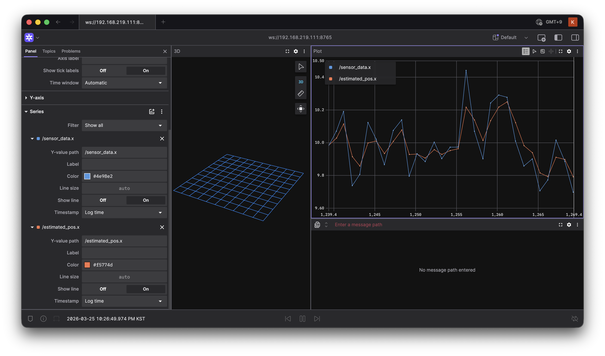

# ROS2 SLAM Bot -  칼만 필터 기반 위치 추청 시스템

## 개요
ROS2 환경에서 C++로 구현한 2D 위치 추정 시스템입니다.  
노이즈가 섞인 센서 데이터를 칼만 필터로 실시간 보정하며,  
Foxglove Studio로 결과를 시각화 합니다.
  
## 기술 스택
- C++ / ROS2 Jazzy
- Eigen3 (선형대수 라이브러리)
- Foxglove Studio (실시간 시각화)
- Raspberry Pi 5 (실행환경)

## 시스템 구조
```
[Position_estimator 노드]
        ⬇
[Kalman_filter 노드]
        ⬇
[Foxglove Studio]
        ↪ 실시간 그래프 시각화
```

## 핵심 구현 내용
- Publisher/Subscriber 구조로 노드 간 데이터 파이프라인 구성
- 칼만 필터 Predict/Update 사이클 C++로 직접 구현
- Eigen3 라이브러리로 행렬 연산 처리
- Foxglove Bridge로 맥북에서 실시간 모니터링

## 결과


- 파란선 : 노이즈 섞인 원본 센서 데이터
- 주황선 : 칼만 필터가 보정한 위치 (노이즈 감소)

## 실행 방법
```bash
# 터미널 1 - 센서 데이터 발행
ros2 run slam_bot position_estimator

# 터미널 2 - 칼만 필터 보정
ros2 run slam_bot kalman_filter

# 터미널 3 - Foxglove_bridge
ros2 launch foxglove_bridge_launch. xml port:=8765
```

## 개발 환경
- OS : Ubuntu 24.04 LTS (Raspberry Pi 5)
- ROS2 : Jazzy
- 언어 : C++17